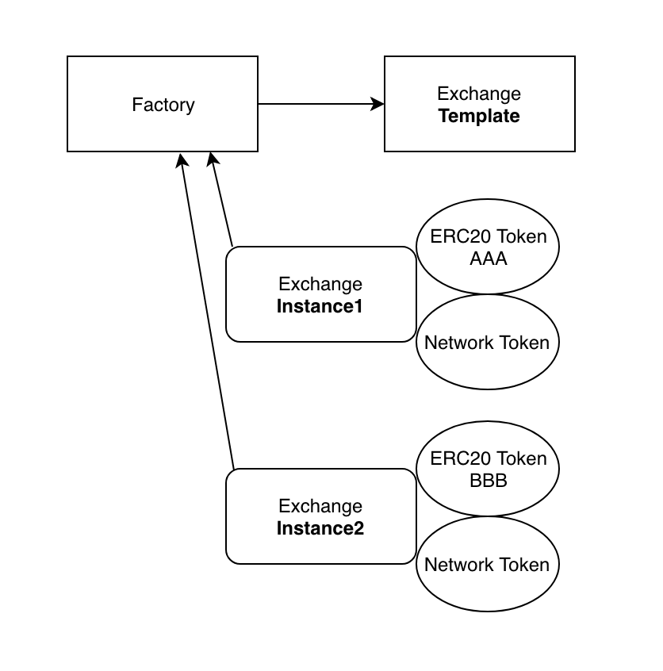

# Uniswap Smart Contract Example
This page contains a blow by blow example of how to initialize, deploy and then interact with the Uniswap Smart Contracts. All work will be performed in the web3 console. At the end of this tutorial example we will be performing the necessary [Uniswap Frontend](https://github.com/Uniswap/uniswap-frontend) configuration. The outcome being your own complete Uniswap exchange application like the official [Uniswap Exchange](https://uniswap.exchange/swap).

## Vyper
The original [Solidity](https://github.com/Uniswap/old-solidity-contracts) Smart Contracts are out of date. Therefore we will be using the [current Vyper Smart Contracts](https://github.com/Uniswap/contracts-vyper) during this tutorial example. 

### Housekeeping
Let's create some new accounts for demonstration purposes.

```javascript
personal.newAccount()
"0x3c01e0f0053173c6f91f02a185b88e96afa24c65"
personal.newAccount()
"0x191148774961c172f187957e3cd9cf7bbc0b4abf"
```

Let's assign some meaningful names to those new accounts

```javascript
factoryOwner = "0x3c01e0f0053173c6f91f02a185b88e96afa24c65"
tokenOwner = "0x191148774961c172f187957e3cd9cf7bbc0b4abf"
```

### Factory
The first step in creating a Uniswap Exchange instance is to initialize the Uniswap Factory Smart Contract. We will need to get the Factory [ABI](https://raw.githubusercontent.com/Uniswap/contracts-vyper/master/abi/uniswap_factory.json) and [Bytecode](https://raw.githubusercontent.com/Uniswap/contracts-vyper/master/bytecode/factory.txt), which we then paste into the web3 console like this. Note that we surround the bytecode below with double quotes!

```javascript
uniswapFactoryAbi = [{"name": "NewExchange", "inputs": [{"type": "address", "name": "token", "indexed": true}, {"type": "address", "name": "exchange", "indexed": true}], "anonymous": false, "type": "event"}, {"name": "initializeFactory", "outputs": [], "inputs": [{"type": "address", "name": "template"}], "constant": false, "payable": false, "type": "function", "gas": 35725}, {"name": "createExchange", "outputs": [{"type": "address", "name": "out"}], "inputs": [{"type": "address", "name": "token"}], "constant": false, "payable": false, "type": "function", "gas": 187911}, {"name": "getExchange", "outputs": [{"type": "address", "name": "out"}], "inputs": [{"type": "address", "name": "token"}], "constant": true, "payable": false, "type": "function", "gas": 715}, {"name": "getToken", "outputs": [{"type": "address", "name": "out"}], "inputs": [{"type": "address", "name": "exchange"}], "constant": true, "payable": false, "type": "function", "gas": 745}, {"name": "getTokenWithId", "outputs": [{"type": "address", "name": "out"}], "inputs": [{"type": "uint256", "name": "token_id"}], "constant": true, "payable": false, "type": "function", "gas": 736}, {"name": "exchangeTemplate", "outputs": [{"type": "address", "name": "out"}], "inputs": [], "constant": true, "payable": false, "type": "function", "gas": 633}, {"name": "tokenCount", "outputs": [{"type": "uint256", "name": "out"}], "inputs": [], "constant": true, "payable": false, "type": "function", "gas": 663}]
```

```javascript
uniswapFactoryBytecode = "0x6103f056600035601c52740100000000000000000000000000000000000000006020526f7fffffffffffffffffffffffffffffff6040527fffffffffffffffffffffffffffffffff8000000000000000000000000000000060605274012a05f1fffffffffffffffffffffffffdabf41c006080527ffffffffffffffffffffffffed5fa0e000000000000000000000000000000000060a05263538a3f0e60005114156100ed57602060046101403734156100b457600080fd5b60043560205181106100c557600080fd5b50600054156100d357600080fd5b60006101405114156100e457600080fd5b61014051600055005b631648f38e60005114156102bf576020600461014037341561010e57600080fd5b600435602051811061011f57600080fd5b50600061014051141561013157600080fd5b6000600054141561014157600080fd5b60026101405160e05260c052604060c020541561015d57600080fd5b7f602e600c600039602e6000f33660006000376110006000366000730000000000610180526c010000000000000000000000006000540261019b527f5af41558576110006000f30000000000000000000000000000000000000000006101af5260406101806000f0806101cf57600080fd5b61016052610160513b6101e157600080fd5b610160513014156101f157600080fd5b6000600060246366d3820361022052610140516102405261023c6000610160515af161021c57600080fd5b6101605160026101405160e05260c052604060c020556101405160036101605160e05260c052604060c02055600154600160015401101561025c57600080fd5b6001600154016102a0526102a0516001556101405160046102a05160e05260c052604060c0205561016051610140517f9d42cb017eb05bd8944ab536a8b35bc68085931dd5f4356489801453923953f960006000a36101605160005260206000f3005b6306f2bf62600051141561030e57602060046101403734156102e057600080fd5b60043560205181106102f157600080fd5b5060026101405160e05260c052604060c0205460005260206000f3005b6359770438600051141561035d576020600461014037341561032f57600080fd5b600435602051811061034057600080fd5b5060036101405160e05260c052604060c0205460005260206000f3005b63aa65a6c0600051141561039a576020600461014037341561037e57600080fd5b60046101405160e05260c052604060c0205460005260206000f3005b631c2bbd1860005114156103c05734156103b357600080fd5b60005460005260206000f3005b639f181b5e60005114156103e65734156103d957600080fd5b60015460005260206000f3005b60006000fd5b6100046103f0036100046000396100046103f0036000f3"
```
From here we can go ahead and create a variable for the Uniswap Factory Smart Contract.

```javascript
var uniswapFactoryContract = web3.cmt.contract(uniswapFactoryAbi, function(error, result){if(!error){console.log(result)}else{console.log(error)}});
```

Then lastly deploy the Uniswap Factory Contract on the blockchain

```javascript
var deployedUniswapFactoryContract = uniswapFactoryContract.new({from:factoryOwner, data: uniswapFactoryBytecode, gas:"5000000"}, function(error, result){if(!error){console.log(result)}else{console.log(error)}});
```

To retrieve the Uniswap Factory Contract's address use the following command

```javascript
deployedUniswapFactoryContract.address
"0x508dbcc197e61328c88f76f1523f7286218ce3b5"
```
### Exchange
We will need to get the Exchange [ABI](https://raw.githubusercontent.com/Uniswap/contracts-vyper/master/abi/uniswap_exchange.json) and [Bytecode](https://raw.githubusercontent.com/Uniswap/contracts-vyper/master/bytecode/factory.txt) and then deploy a one-off Exchange template.

```javascript
uniswapExchangeAbi = [{"name": "TokenPurchase", "inputs": [{"type": "address", "name": "buyer", "indexed": true}, {"type": "uint256", "name": "eth_sold", "indexed": true}, {"type":> uniswapExchangeAbi = [{"name": "TokenPurchase", "inputs": [{"type": "address", "name": "buyer", "indexed": true}, {"type": "uint256", "name": "eth_sold", "indexed": true}, {"type": "uint256", "name": "tokens_bought", "indexed": true}], "anonymous": false, "type": "event"}, {"name": "EthPurchase", "inputs": [{"type": "address", "name": "buyer", "indexed": true}> uniswapExchangeAbi = [{"name": "TokenPurchase", "inputs": [{"type": "address", "name": "buyer", "indexed": true}, {"type": "uint256", "name": "eth_sold", "indexed": true}, {"type": "uint256", "name": "tokens_bought", "indexed": true}], "anonymous": false, "type": "event"}, {"name": "EthPurchase", "inputs": [{"type": "address", "name": "buyer", "indexed": true}> uniswapExchangeAbi = [{"name": "TokenPurchase", "inputs": [{"type": "address", "name": "buyer", "indexed": true}, {"type": "uint256", "name": "eth_sold", "indexed": true}, {"type": "uint256", "name": "tokens_bought", "indexed": true}], "anonymous": false, "type": "event"}, {"name": "EthPurchase", "inputs": [{"type": "address", "name": "buyer", "indexed": true}, {"type": "uint256", "name": "tokens_sold", "indexed": true}, {"type": "uint256", "name": "eth_bought", "indexed": true}], "anonymous": false, "type": "event"}, {"name": "AddLiquidity", "inputs": [{"type": "address", "name": "provider", "indexed": true}, {"type": "uint256", "name": "eth_amount", "indexed": true}, {"type": "uint256", "name": "token_amount", "ind> uniswapExchangeAbi = [{"name": "TokenPurchase", "inputs": [{"type": "address", "name": "buyer", "indexed": true}, {"type": "uint256", "name": "eth_sold", "indexed": true}, {"type": "uint256", "name": "tokens_bought", "indexed": true}], "anonymous": false, "type": "event"}, {"name": "EthPurchase", "inputs": [{"type": "address", "name": "buyer", "indexed": true}, {"type": "uint256", "name": "tokens_sold", "indexed": true}, {"type": "uint256", "name": "eth_bought", "indexed": true}], "anonymous": false, "type": "event"}, {"name": "AddLiquidity", "inputs": [{"type": "address", "name": "provider", "indexed": true}, {"type": "uint256", "name": "eth_amount", "indexed": true}, {"type": "uint256", "name": "token_amount", "indexed": true}], "anonymous": false, "type": "event"}, {"name": "RemoveLiquidity", "inputs": [{"type": "address", "name": "provider", "indexed": true}, {"type": "uint256", "name": "eth> uniswapExchangeAbi = [{"name": "TokenPurchase", "inputs": [{"type": "address", "name": "buyer", "indexed": true}, {"type": "uint256", "name": "eth_sold", "indexed": true}, {"type": "uint256", "name": "tokens_bought", "indexed": true}], "anonymous": false, "type": "event"}, {"name": "EthPurchase", "inputs": [{"type": "address", "name": "buyer", "indexed": true}, {"type": "uint256", "name": "tokens_sold", "indexed": true}, {"type": "uint256", "name": "eth_bought", "indexed": true}], "anonymous": false, "type": "event"}, {"name": "AddLiquidity", "inputs": [{"type": "address", "name": "provider", "indexed": true}, {"type": "uint256", "name": "eth_amount", "indexed": true}, {"type": "uint256", "name": "token_amount", "indexed": true}], "anonymous": false, "type": "event"}, {"name": "RemoveLiquidity", "inputs": [{"type": "address", "name": "provider", "indexed": true}, {"type": "uint256", "name": "eth_amount", "indexed": true}, {"type": "uint256", "name": "token_amount", "indexed": true}], "anonymous": false, "type": "event"}, {"name": "Transfer", "inputs": [{"type": "address", "> uniswapExchangeAbi = [{"name": "TokenPurchase", "inputs": [{"type": "address", "name": "buyer", "indexed": true}, {"type": "uint256", "name": "eth_sold", "indexed": true}, {"type": "uint256", "name": "tokens_bought", "indexed": true}], "anonymous": false, "type": "event"}, {"name": "EthPurchase", "inputs": [{"type": "address", "name": "buyer", "indexed": true}, {"type": "uint256", "name": "tokens_sold", "indexed": true}, {"type": "uint256", "name": "eth_bought", "indexed": true}], "anonymous": false, "type": "event"}, {"name": "AddLiquidity", "inputs": [{"type": "address", "name": "provider", "indexed": true}, {"type": "uint256", "name": "eth_amount", "indexed": true}, {"type": "uint256", "name": "token_amount", "indexed": true}], "anonymous": false, "type": "event"}, {"name": "RemoveLiquidity", "inputs": [{"type": "address", "name": "provider", "indexed": true}, {"type": "uint256", "name": "eth_amount", "indexed": true}, {"type": "uint256", "name": "token_amount", "indexed": true}], "anonymous": false, "type": "event"}, {"name": "Transfer", "inputs": [{"type": "address", "name": "_from", "indexed": true}, {"type": "address", "name": "_to", "indexed": true}, {"type": "uint256", "name": "_value", "indexed": false}], "anonymous": false, "type": "event"}, {"name": "Approval", "inputs": [{"type": "address", "name": "_owner", "indexed": true}, {"type": "address", "name": "_spender", "indexed": true}, {"type": "uint256", "name": "_value> uniswapExchangeAbi = [{"name": "TokenPurchase", "inputs": [{"type": "address", "name": "buyer", "indexed": true}, {"type": "uint256", "name": "eth_sold", "indexed": true}, {"type": "uint256", "name": "tokens_bought", "indexed": true}], "anonymous": false, "type": "event"}, {"name": "EthPurchase", "inputs": [{"type": "address", "name": "buyer", "indexed": true}, {"type": "uint256", "name": "tokens_sold", "indexed": true}, {"type": "uint256", "name": "eth_bought", "indexed": true}], "anonymous": false, "type": "event"}, {"name": "AddLiquidity", "inputs": [{"type": "address", "name": "provider", "indexed": true}, {"type": "uint256", "name": "eth_amount", "indexed": true}, {"type": "uint256", "name": "token_amount", "indexed": true}], "anonymous": false, "type": "event"}, {"name": "RemoveLiquidity", "inputs": [{"type": "address", "name": "provider", "indexed": true}, {"type": "uint256", "name": "eth_amount", "indexed": true}, {"type": "uint256", "name": "token_amount", "indexed": true}], "anonymous": false, "type": "event"}, {"name": "Transfer", "inputs": [{"type": "address", "name": "_from", "indexed": true}, {"type": "address", "name": "_to", "indexed": true}, {"type": "uint256", "name": "_value", "indexed": false}], "anonymous": false, "type": "event"}, {"name": "Approval", "inputs": [{"type": "address", "name": "_owner", "indexed": true}, {"type": "address", "name": "_spender", "indexed": true}, {"type": "uint256", "name": "_value", "indexed": false}], "anonymous": false, "type": "event"}, {"name": "setup", "outputs": [], "inputs": [{"type": "address", "name": "token_addr"}], "constant": false, "payable": fal> uniswapExchangeAbi = [{"name": "TokenPurchase", "inputs": [{"type": "address", "name": "buyer", "indexed": true}, {"type": "uint256", "name": "eth_sold", "indexed": true}, {"type": "uint256", "name": "tokens_bought", "indexed": true}], "anonymous": false, "type": "event"}, {"name": "EthPurchase", "inputs": [{"type": "address", "name": "buyer", "indexed": true}, {"type": "uint256", "name": "tokens_sold", "indexed": true}, {"type": "uint256", "name": "eth_bought", "indexed": true}], "anonymous": false, "type": "event"}, {"name": "AddLiquidity", "inputs": [{"type": "address", "name": "provider", "indexed": true}, {"type": "uint256", "name": "eth_amount", "indexed": true}, {"type": "uint256", "name": "token_amount", "indexed": true}], "anonymous": false, "type": "event"}, {"name": "RemoveLiquidity", "inputs": [{"type": "address", "name": "provider", "indexed": true}, {"type": "uint256", "name": "eth_amount", "indexed": true}, {"type": "uint256", "name": "token_amount", "indexed": true}], "anonymous": false, "type": "event"}, {"name": "Transfer", "inputs": [{"type": "address", "name": "_from", "indexed": true}, {"type": "address", "name": "_to", "indexed": true}, {"type": "uint256", "name": "_value", "indexed": false}], "anonymous": false, "type": "event"}, {"name": "Approval", "inputs": [{"type": "address", "name": "_owner", "indexed": true}, {"type": "address", "name": "_spender", "indexed": true}, {"type": "uint256", "name": "_value", "indexed": false}], "anonymous": false, "type": "event"}, {"name": "setup", "outputs": [], "inputs": [{"type": "address", "name": "token_addr"}], "constant": false, "payable": false, "type": "function", "gas": 175875}, {"name": "addLiquidity", "outputs": [{"type": "uint256", "name": "out"}], "inputs": [{"type": "uint256", "name": "min_liquidity"}, {"type": "uint256", "name": "max_tokens"}, {"type": "uint256", "name": "deadline"}], "constant": false, "payable": true, "type": "function", "gas": 82616}, {"name": "removeLiquidity", "outputs"> uniswapExchangeAbi = [{"name": "TokenPurchase", "inputs": [{"type": "address", "name": "buyer", "indexed": true}, {"type": "uint256", "name": "eth_sold", "indexed": true}, {"type": "uint256", "name": "tokens_bought", "indexed": true}], "anonymous": false, "type": "event"}, {"name": "EthPurchase", "inputs": [{"type": "address", "name": "buyer", "indexed": true}, {"type": "uint256", "name": "tokens_sold", "indexed": true}, {"type": "uint256", "name": "eth_bought", "indexed": true}], "anonymous": false, "type": "event"}, {"name": "AddLiquidity", "inputs": [{"type": "address", "name": "provider", "indexed": true}, {"type": "uint256", "name": "eth_amount", "indexed": true}, {"type": "uint256", "name": "token_amount", "indexed": true}], "anonymous": false, "type": "event"}, {"name": "RemoveLiquidity", "inputs": [{"type": "address", "name": "provider", "indexed": true}, {"type": "uint256", "name": "eth_amount", "indexed": true}, {"type": "uint256", "name": "token_amount", "indexed": true}], "anonymous": false, "type": "event"}, {"name": "Transfer", "inputs": [{"type": "address", "name": "_from", "indexed": true}, {"type": "address", "name": "_to", "indexed": true}, {"type": "uint256", "name": "_value", "indexed": false}], "anonymous": false, "type": "event"}, {"name": "Approval", "inputs": [{"type": "address", "name": "_owner", "indexed": true}, {"type": "address", "name": "_spender", "indexed": true}, {"type": "uint256", "name": "_value", "indexed": false}], "anonymous": false, "type": "event"}, {"name": "setup", "outputs": [], "inputs": [{"type": "address", "name": "token_addr"}], "constant": false, "payable": false, "type": "function", "gas": 175875}, {"name": "addLiquidity", "outputs": [{"type": "uint256", "name": "out"}], "inputs": [{"type": "uint256", "name": "min_liquidity"}, {"type": "uint256", "name": "max_tokens"}, {"type": "uint256", "name": "deadline"}], "constant": false, "payable": true, "type": "function", "gas": 82616}, {"name": "removeLiquidity", "outputs": [{"type": "uint256", "name": "out"}, {"type": "uint256", "name": "out"}], "inputs": [{"type": "uint256", "name": "amount"}, {"type": "uint256", "name": "min_eth"}, {"type": "uint256", "name": "min_tokens"}, {"type": "uint256", "name": "deadline"}], "constant": false, "payable": false, "type": "function", "gas": 116814}, {"name": "__default__", "outputs": [], "inputs": [], "constant": false, "payable": true, "type": "function"}, {"name": "ethToTokenSwapInput", "outputs": [{"type": "uint256", "name": "out"}], "inputs": [{"type": "uint256", "name": "min_tokens"}, {"type": "uint256", "name": "deadline"}], "constant": false, "payable": true, "type": "function", "gas": 12757}, {"name": "ethToTokenTransferInput", "outputs": [{"type": "uint256", "name": "out"}], "inputs": [{"type": "uint256", "name": "min_tokens"}, {"type": "uint256", "name": "deadline"}, {"type": "address", "name": "recipient"}], "constant": false, "payable": true, "type": "function", "gas": 12965}, {"name": "ethToTokenSwapOutput", "outputs": [{"type": "uint256", "name": "out"}], "inputs": [{"type": "uint256", "name": "tokens_bought"}, {"type": "uint256", "name": "deadline"}], "constant": false, "payable": true, "type": "function", "gas": 50463}, {"name": "ethToTokenTransferOutput", "outputs": [{"type": "uint256", "name": "out"}], "inputs": [{"type": "uint256", "name": "tokens_bought"}, {"type": "uint256", "name": "deadline"}, {"type": "address", "name": "recipient"}], "constant": false, "payable": true, "type": "function", "gas": 50671}, {"name": "tokenToEthSwapInput", "outputs": [{"type": "uint256", "name": "out"}], "inputs": [{"type": "uint256", "name": "tokens_sold"}, {"type": "uint256", "name": "min_eth"}, {"type": "uint256", "name": "deadline"}], "constant": false, "payable": false, "type": "function", "gas": 47503}, {"name": "tokenToEthTransferInput", "outputs": [{"type": "uint256", "name": "out"}], "inputs": [{"type": "uint256", "name": "tokens_sold"}, {"type": "uint256", "name": "min_eth"}, {"type": "uint256", "name": "deadline"}, {"type": "address", "name": "recipient"}], "constant": false, "payable": false, "type": "function", "gas": 47712}, {"name": "tokenToEthSwapOutput", "outputs": [{"type": "uint256", "name": "out"}], "inputs": [{"type": "uint256", "name": "eth_bought"}, {"type": "uint256", "name": "max_tokens"}, {"type": "uint256", "name": "deadline"}], "constant": false, "payable": false, "type": "function", "gas": 50175}, {"name": "tokenToEthTransferOutput", "outputs": [{"type": "uint256", "name": "out"}], "inputs": [{"type": "uint256", "name": "eth_bought"}, {"type": "uint256", "name": "max_tokens"}, {"type": "uint256", "name": "deadline"}, {"type": "address", "name": "recipient"}], "constant": false, "payable": false, "type": "function", "gas": 50384}, {"name": "tokenToTokenSwapInput", "outputs": [{"type": "uint256", "name": "out"}], "inputs": [{"type": "uint256", "name": "tokens_sold"}, {"type": "uint256", "name": "min_tokens_bought"}, {"type": "uint256", "name": "min_eth_bought"}, {"type": "uint256", "name": "deadline"}, {"type": "address", "name": "token_addr"}], "constant": false, "payable": false, "type": "function", "gas": 51007}, {"name": "tokenToTokenTransferInput", "outputs": [{"type": "uint256", "name": "out"}], "inputs": [{"type": "uint256", "name": "tokens_sold"}, {"type": "uint256", "name": "min_tokens_bought"}, {"type": "uint256", "name": "min_eth_bought"}, {"type": "uint256", "name": "deadline"}, {"type": "address", "name": "recipient"}, {"type": "address", "name": "token_addr"}], "constant": false, "payable": false, "type": "function", "gas": 51098}, {"name": "tokenToTokenSwapOutput", "outputs": [{"type": "uint256", "name": "out"}], "inputs": [{"type": "uint256", "name": "tokens_bought"}, {"type": "uint256", "name": "max_tokens_sold"}, {"type": "uint256", "name": "max_eth_sold"}, {"type": "uint256", "name": "deadline"}, {"type": "address", "name": "token_addr"}], "constant": false, "payable": false, "type": "function", "gas": 54928}, {"name": "tokenToTokenTransferOutput", "outputs": [{"type": "uint256", "name": "out"}], "inputs": [{"type": "uint256", "name": "tokens_bought"}, {"type": "uint256", "name": "max_tokens_sold"}, {"type": "uint256", "name": "max_eth_sold"}, {"type": "uint256", "name": "deadline"}, {"type": "address", "name": "recipient"}, {"type": "address", "name": "token_addr"}], "constant": false, "payable": false, "type": "function", "gas": 55019}, {"name": "tokenToExchangeSwapInput", "outputs": [{"type": "uint256", "name": "out"}], "inputs": [{"type": "uint256", "name": "tokens_sold"}, {"type": "uint256", "name": "min_tokens_bought"}, {"type": "uint256", "name": "min_eth_bought"}, {"type": "uint256", "name": "deadline"}, {"type": "address", "name": "exchange_addr"}], "constant": false, "payable": false, "type": "function", "gas": 49342}, {"name": "tokenToExchangeTransferInput", "outputs": [{"type": "uint256", "name": "out"}], "inputs": [{"type": "uint256", "name": "tokens_sold"}, {"type": "uint256", "name": "min_tokens_bought"}, {"type": "uint256", "name": "min_eth_bought"}, {"type": "uint256", "name": "deadline"}, {"type": "address", "name": "recipient"}, {"type": "address", "name": "exchange_addr"}], "constant": false, "payable": false, "type": "function", "gas": 49532}, {"name": "tokenToExchangeSwapOutput", "outputs": [{"type": "uint256", "name": "out"}], "inputs": [{"type": "uint256", "name": "tokens_bought"}, {"type": "uint256", "name": "max_tokens_sold"}, {"type": "uint256", "name": "max_eth_sold"}, {"type": "uint256", "name": "deadline"}, {"type": "address", "name": "exchange_addr"}], "constant": false, "payable": false, "type": "function", "gas": 53233}, {"name": "tokenToExchangeTransferOutput", "outputs": [{"type": "uint256", "name": "out"}], "inputs": [{"type": "uint256", "name": "tokens_bought"}, {"type": "uint256", "name": "max_tokens_sold"}, {"type": "uint256", "name": "max_eth_sold"}, {"type": "uint256", "name": "deadline"}, {"type": "address", "name": "recipient"}, {"type": "address", "name": "exchange_addr"}], "constant": false, "payable": false, "type": "function", "gas": 53423}, {"name": "getEthToTokenInputPrice", "outputs": [{"type": "uint256", "name": "out"}], "inputs": [{"type": "uint256", "name": "eth_sold"}], "constant": true, "payable": false, "type": "function", "gas": 5542}, {"name": "getEthToTokenOutputPrice", "outputs": [{"type": "uint256", "name": "out"}], "inputs": [{"type": "uint256", "name": "tokens_bought"}], "constant": true, "payable": false, "type": "function", "gas": 6872}, {"name": "getTokenToEthInputPrice", "outputs": [{"type": "uint256", "name": "out"}], "inputs": [{"type": "uint256", "name": "tokens_sold"}], "constant": true, "payable": false, "type": "function", "gas": 5637}, {"name": "getTokenToEthOutputPrice", "outputs": [{"type": "uint256", "name": "out"}], "inputs": [{"type": "uint256", "name": "eth_bought"}], "constant": true, "payable": false, "type": "function", "gas": 6897}, {"name": "tokenAddress", "outputs": [{"type": "address", "name": "out"}], "inputs": [], "constant": true, "payable": false, "type": "function", "gas": 1413}, {"name": "factoryAddress", "outputs": [{"type": "address", "name": "out"}], "inputs": [], "constant": true, "payable": false, "type": "function", "gas": 1443}, {"name": "balanceOf", "outputs": [{"type": "uint256", "name": "out"}], "inputs": [{"type": "address", "name": "_owner"}], "constant": true, "payable": false, "type": "function", "gas": 1645}, {"name": "transfer", "outputs": [{"type": "bool", "name": "out"}], "inputs": [{"type": "address", "name": "_to"}, {"type": "uint256", "name": "_value"}], "constant": false, "payable": false, "type": "function", "gas": 75034}, {"name": "transferFrom", "outputs": [{"type": "bool", "name": "out"}], "inputs": [{"type": "address", "name": "_from"}, {"type": "address", "name": "_to"}, {"type": "uint256", "name": "_value"}], "constant": false, "payable": false, "type": "function", "gas": 110907}, {"name": "approve", "outputs": [{"type": "bool", "name": "out"}], "inputs": [{"type": "address", "name": "_spender"}, {"type": "uint256", "name": "_value"}], "constant": false, "payable": false, "type": "function", "gas": 38769}, {"name": "allowance", "outputs": [{"type": "uint256", "name": "out"}], "inputs": [{"type": "address", "name": "_owner"}, {"type": "address", "name": "_spender"}], "constant": true, "payable": false, "type": "function", "gas": 1925}, {"name": "name", "outputs": [{"type": "bytes32", "name": "out"}], "inputs": [], "constant": true, "payable": false, "type": "function", "gas": 1623}, {"name": "symbol", "outputs": [{"type": "bytes32", "name": "out"}], "inputs": [], "constant": true, "payable": false, "type": "function", "gas": 1653}, {"name": "decimals", "outputs": [{"type": "uint256", "name": "out"}], "inputs": [], "constant": true, "payable": false, "type": "function", "gas": 1683}, {"name": "totalSupply", "outputs": [{"type": "uint256", "name": "out"}], "inputs": [], "constant": true, "payable": false, "type": "function", "gas": 1713}]
```

```javascript
uniswapExchangeBytecode = "0x6103f056600035601c52740100000000000000000000000000000000000000006020526f7fffffffffffffffffffffffffffffff6040527fffffffffffffffffffffffffffffffff8000000000000000000000000000000060605274012a05f1fffffffffffffffffffffffffdabf41c006080527ffffffffffffffffffffffffed5fa0e000000000000000000000000000000000060a05263538a3f0e60005114156100ed57602060046101403734156100b457600080fd5b60043560205181106100c557600080fd5b50600054156100d357600080fd5b60006101405114156100e457600080fd5b61014051600055005b631648f38e60005114156102bf576020600461014037341561010e57600080fd5b600435602051811061011f57600080fd5b50600061014051141561013157600080fd5b6000600054141561014157600080fd5b60026101405160e05260c052604060c020541561015d57600080fd5b7f602e600c600039602e6000f33660006000376110006000366000730000000000610180526c010000000000000000000000006000540261019b527f5af41558576110006000f30000000000000000000000000000000000000000006101af5260406101806000f0806101cf57600080fd5b61016052610160513b6101e157600080fd5b610160513014156101f157600080fd5b6000600060246366d3820361022052610140516102405261023c6000610160515af161021c57600080fd5b6101605160026101405160e05260c052604060c020556101405160036101605160e05260c052604060c02055600154600160015401101561025c57600080fd5b6001600154016102a0526102a0516001556101405160046102a05160e05260c052604060c0205561016051610140517f9d42cb017eb05bd8944ab536a8b35bc68085931dd5f4356489801453923953f960006000a36101605160005260206000f3005b6306f2bf62600051141561030e57602060046101403734156102e057600080fd5b60043560205181106102f157600080fd5b5060026101405160e05260c052604060c0205460005260206000f3005b6359770438600051141561035d576020600461014037341561032f57600080fd5b600435602051811061034057600080fd5b5060036101405160e05260c052604060c0205460005260206000f3005b63aa65a6c0600051141561039a576020600461014037341561037e57600080fd5b60046101405160e05260c052604060c0205460005260206000f3005b631c2bbd1860005114156103c05734156103b357600080fd5b60005460005260206000f3005b639f181b5e60005114156103e65734156103d957600080fd5b60015460005260206000f3005b60006000fd5b6100046103f0036100046000396100046103f0036000f3"
```

We can now create a variable for the Uniswap Exchange template 

```javascript
var uniswapExchangeTemplate = web3.cmt.contract(uniswapExchangeAbi,function(error, result){if(!error){console.log(result)}else{console.log(error)}});
```

Then finally we can deploy the Uniswap Exchange template 

```javascript
var deployedUniswapExchangeTemplate = uniswapExchangeTemplate.new({from:factoryOwner, data: uniswapExchangeBytecode, gas:"5000000"}, function(error, result){if(!error){console.log(result)}else{console.log(error)}});
```

We can obtain the address of this Uniswap Exchange template contract using the following command

```javascript
deployedUniswapExchangeTemplate.address
"0xb2864c1e9d81e733f2cb045e2b2b6595be2cd0ad"
```

At this point we have a Factory contract and an Exchange template contract deployed. We have accomplished the first steps of what is essentially the static scaffolding of the Uniswap exchange instance. Next we are going to initialize the Factory contract and, in doing so, pass in the Exchange template which will result in these two deployed contracts being linked; related. Before we go ahead and relate these two contract instances lets prove that at present the contracts do not know anything about each other.

```javascript
deployedUniswapFactoryContract.exchangeTemplate()
"0x0000000000000000000000000000000000000000"
```

```javascript
deployedUniswapExchangeTemplate.factoryAddress()
"0x0000000000000000000000000000000000000000"
```

As you can see above, if we request the Factory's exchange template or request the exchange template's factory address we simply get back no results. This is correct for this stage of the procedure.

Let's now go ahead and initialize the Uniswap Factory contract by passing in the Uniswap Exchange template contract address as we previously mentioned.

```javascript
deployedUniswapFactoryContract.initializeFactory(deployedUniswapExchangeTemplate.address, {from:factoryOwner})
```

At this stage we are able to request the Factory's exchange template using the following command

```javascript
deployedUniswapFactoryContract.exchangeTemplate()
"0xb2864c1e9d81e733f2cb045e2b2b6595be2cd0ad"
```

Interestingly though, we can not yet get the exchange template's factory address.

```javascript
deployedUniswapExchangeTemplate.factoryAddress()
"0x0000000000000000000000000000000000000000"
```

It is important that you understand the concept of the singular Exchange contract "template" vs the potentially numerous instances of the Exchange contract. The following diagram illustrates that our deployedUniswapFactoryContract can see the one and only exchangeTemplate(). It is important to remember that there will only be one Factory and one Exchange "template" per Uniswap application. On the other hand there are of course going to be many many instances of the Exchanges as shown below. Let's go ahead and create one of these Exchange instances and then demonstrate how to call its factoryAddress().



### Creating an Exchange

We are going to call the Factory contract's createExchange function which will produce a new instance of an Exchange and return the newly minted address for the Exchange instance. Note that we are passing in the address to an existing ERC20 token. This is the token contract which will be traded against the network token once the exchange is created. Obviously you will need to have the address of an ERC20 token to perform this function.

Before we run the createExchange function, let's perform a few simple tests to ensure correct execution.

1) assert token != ZERO_ADDRESS
```javascript
> deployedYuanTokenInstance.address
"0x8390513eb94287c14b3c6ef994842cededd91836" //Check ✓
```
2) assert self.exchangeTemplate != ZERO_ADDRESS
```javascript
> deployedUniswapFactoryContract.exchangeTemplate()
"0xb2864c1e9d81e733f2cb045e2b2b6595be2cd0ad" //Check ✓
```
3) assert self.token_to_exchange[token] == ZERO_ADDRESS
```javascript
> deployedUniswapFactoryContract.getExchange(deployedYuanTokenInstance.address)
"0x0000000000000000000000000000000000000000" //Check ✓
```
Running the createExchange function

```javascript
deployedUniswapFactoryContract.createExchange("0x8390513eb94287c14b3c6ef994842cededd91836", {from:factoryOwner, gas:"50000000"})
```

We promised a little while back that when an exchange instance (for a specific token) was created we would be able to query its Factory and many other details. Let's go ahead and run some commands to ensure that the Factory, Exchange Template and the new Exchange instance are all wired together as intended.

```javascript


```
